# GitOps based deployment for TO-DO application using ArgoCD
This project demonstrates a production-ready GitOps workflow using ArgoCD to deploy a three-tier todo application on Azure Kubernetes Service. It showcases best practices for:

- **GitOps methodology** - Git as the single source of truth
- **Declarative infrastructure** - All configurations defined in code
- **Automated deployments** - Continuous synchronization with Git repository
- **Three-tier architecture** - Frontend(React.js), backend(Node.js), and database(MongoDB) layers
- **Container orchestration** - Kubernetes-native deployment patterns

## Demo video for this project
[Demo link](https://drive.google.com/file/d/1LgEwHf9u81HldnCtUgso1TnEICi3RmkK/view?usp=sharing)

# GitOps Workflow with ArgoCD
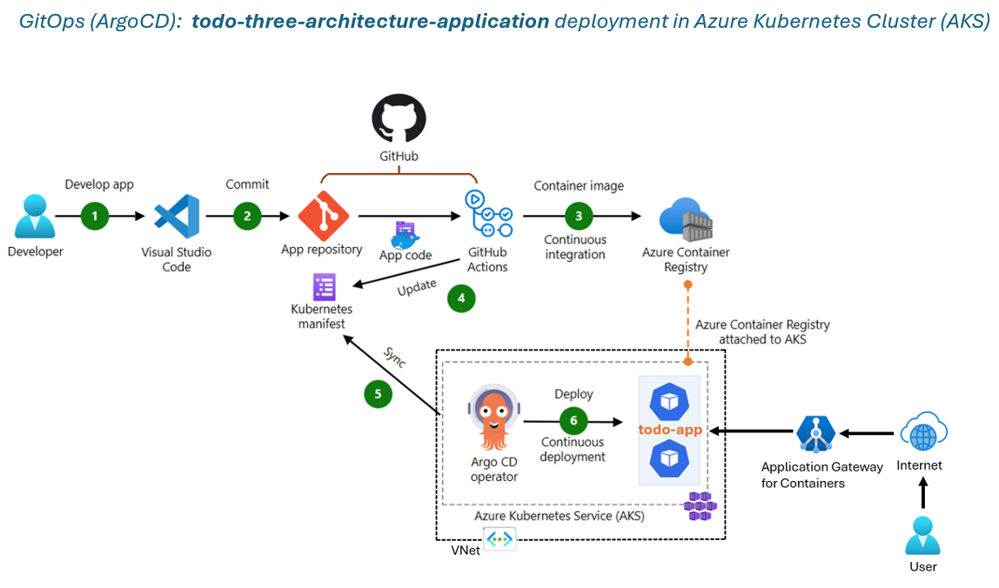


## Prerequisites

Before you begin, ensure you have the following installed and configured:

### Required Tools

- **Azure CLI** (v2.50.0 or higher)
  ```bash
  az --version
  ```

- **kubectl** (v1.27 or higher)
  ```bash
  kubectl version --client
  ```

- **Helm** (v3.12 or higher)
  ```bash
  helm version
  ```

- **Docker** (v24.0 or higher)
  ```bash
  docker --version

# Infrastructure Setup

- Create the Virtual Networks and Subnet to create the Azure Kubernetes Cluster
- Create Azure Container registry and provide permissions to AKS to pull the image

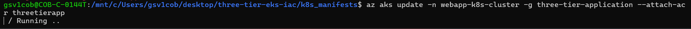

- Create Service Principle for authenticate to ACR for the GitHub Actions
- Create Load Balancer using Azure Gateway for Containers (create frontend and associates the subnets)
- Create Azure Kubernetes Cluster (AKS)

```bash
# Create AKS cluster
AKS_NAME='<your cluster name>'
RESOURCE_GROUP='<your resource group name>'
az aks update -g $RESOURCE_GROUP -n $AKS_NAME --enable-oidc-issuer --enable-workload-identity --no-wait

AKS_NAME='<your cluster name>'
RESOURCE_GROUP='<your resource group name>'
LOCATION='northeurope'
VM_SIZE='<the size of the vm in AKS>' # The size needs to be available in your location

az group create --name $RESOURCE_GROUP --location $LOCATION
az aks create --resource-group $RESOURCE_GROUP --name $AKS_NAME --location $LOCATION --node-vm-size $VM_SIZE --network-plugin azure --enable-oidc-issuer --enable-workload-identity --generate-ssh-key

az aks get-credentials \
  --resource-group $RESOURCE_GROUP \
  --name $AKS_CLUSTER_NAME \
  --overwrite-existing
```
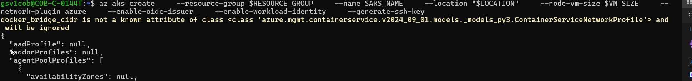

- Install ALB Controller (Prerequisite: Install Helm)

```bash
RESOURCE_GROUP='<your resource group name>'
AKS_NAME='<your aks cluster name>'
IDENTITY_RESOURCE_NAME='azure-alb-identity'

mcResourceGroup=$(az aks show --resource-group $RESOURCE_GROUP --name $AKS_NAME --query "nodeResourceGroup" -o tsv)
mcResourceGroupId=$(az group show --name $mcResourceGroup --query id -otsv)

az identity create --resource-group $RESOURCE_GROUP --name $IDENTITY_RESOURCE_NAME
principalId="$(az identity show -g $RESOURCE_GROUP -n $IDENTITY_RESOURCE_NAME --query principalId -otsv)"

az role assignment create --assignee-object-id $principalId --assignee-principal-type ServicePrincipal --scope $mcResourceGroupId --role "acdd72a7-3385-48ef-bd42-f606fba81ae7" # Reader role

AKS_OIDC_ISSUER="$(az aks show -n "$AKS_NAME" -g "$RESOURCE_GROUP" --query "oidcIssuerProfile.issuerUrl" -o tsv)"
az identity federated-credential create --name "azure-alb-identity" --identity-name "$IDENTITY_RESOURCE_NAME" --resource-group $RESOURCE_GROUP --issuer "$AKS_OIDC_ISSUER" --subject "system:serviceaccount:azure-alb-system:alb-controller-sa"

HELM_NAMESPACE='<namespace for deployment>'
CONTROLLER_NAMESPACE='azure-alb-system'
az aks get-credentials --resource-group $RESOURCE_GROUP --name $AKS_NAME
helm install alb-controller oci://mcr.microsoft.com/application-lb/charts/alb-controller --namespace $HELM_NAMESPACE --version 1.9.11 --set albController.namespace=$CONTROLLER_NAMESPACE --set albController.podIdentity.clientID=$(az identity show -g $RESOURCE_GROUP -n azure-alb-identity --query clientId -o tsv)
```

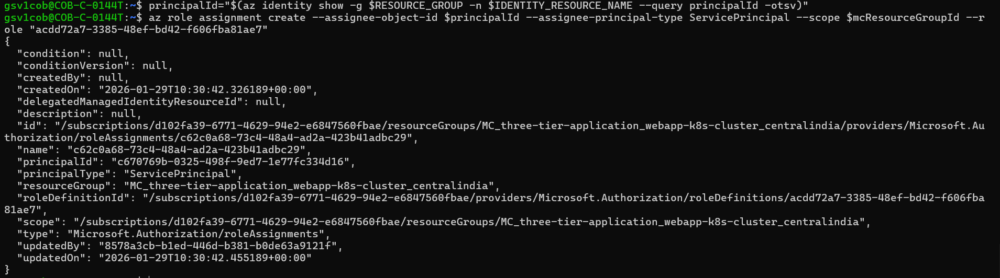

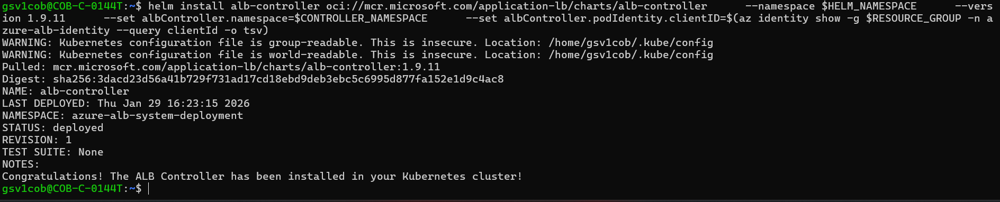

- Verify the ALB Installation
```bash
kubectl get pods -n azure-alb-system
```
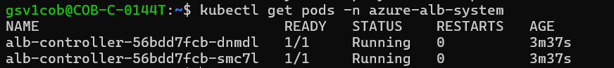

- Verify GatewayClass azure-alb-external is installed on your cluster
```bash
kubectl get gatewayclass azure-alb-external -o yaml
```
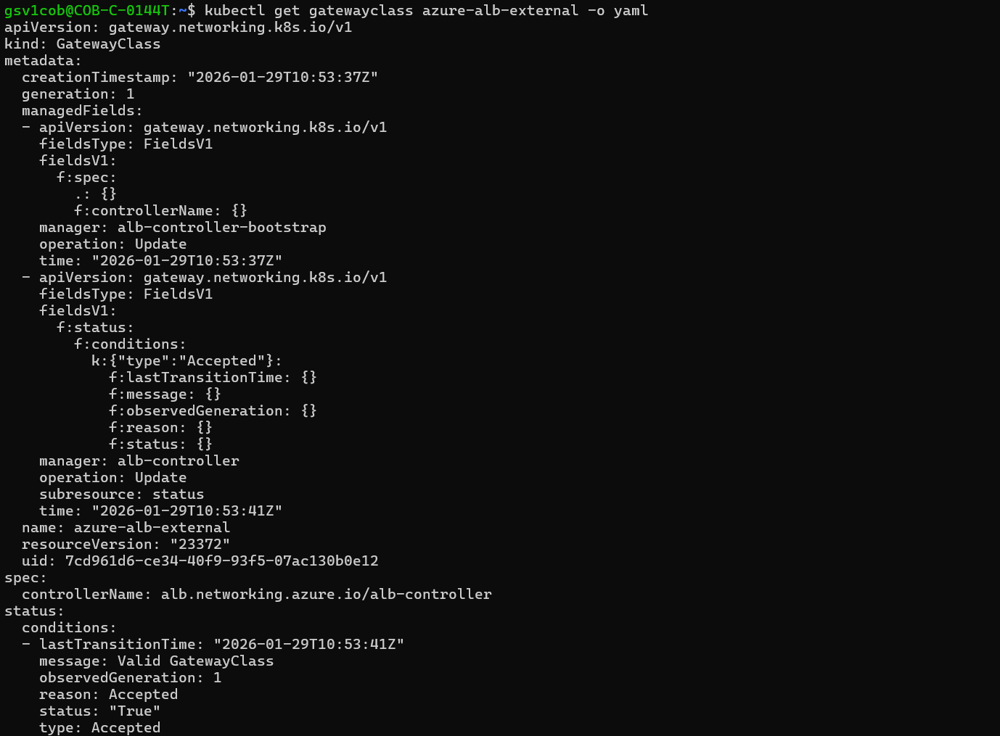

- Create Application Gateway for Controllers
```bash
RESOURCE_GROUP='<your resource group name>'
AGFC_NAME='alb-test' # Name of the Application Gateway for Containers resource to be created
az network alb create -g $RESOURCE_GROUP -n $AGFC_NAME
```
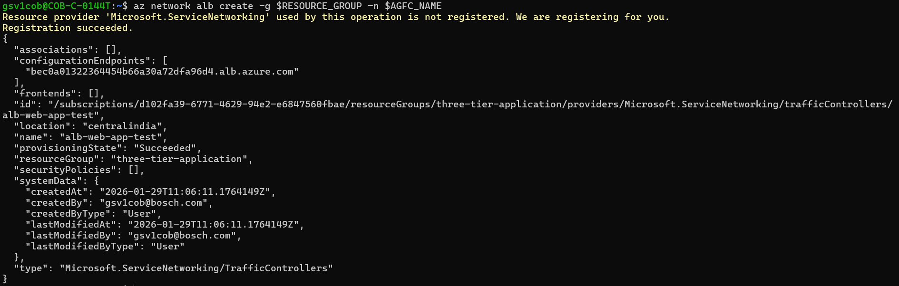

- Create a frontend resource
```bash
FRONTEND_NAME='test-frontend'
az network alb frontend create -g $RESOURCE_GROUP -n $FRONTEND_NAME --alb-name $AGFC_NAME
```
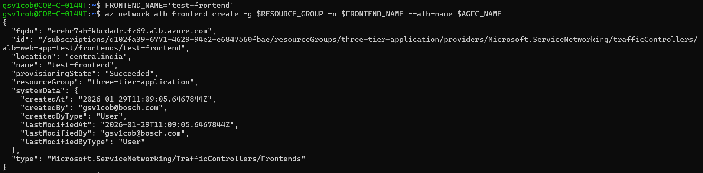

- Delegate a subnet to association resource
```bash
VNET_NAME='<name of the virtual network to use>'
VNET_RESOURCE_GROUP='<the resource group of your VNET>'
ALB_SUBNET_NAME='subnet-alb' # subnet name can be any non-reserved subnet name (i.e. GatewaySubnet, AzureFirewallSubnet, AzureBastionSubnet would all be invalid)
az network vnet subnet update --resource-group $VNET_RESOURCE_GROUP --name $ALB_SUBNET_NAME --vnet-name $VNET_NAME --delegations 'Microsoft.ServiceNetworking/trafficControllers'
ALB_SUBNET_ID=$(az network vnet subnet list --resource-group $VNET_RESOURCE_GROUP --vnet-name $VNET_NAME --query "[?name=='$ALB_SUBNET_NAME'].id" --output tsv)
echo $ALB_SUBNET_ID
```
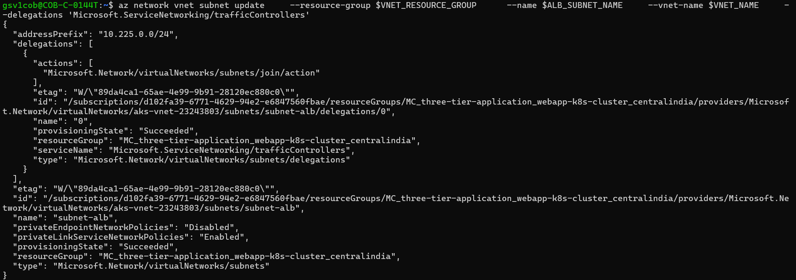

- Delegate permissions to managed identity
```bash
IDENTITY_RESOURCE_NAME='azure-alb-identity'

resourceGroupId=$(az group show --name $RESOURCE_GROUP --query id -otsv)
principalId=$(az identity show -g $RESOURCE_GROUP -n $IDENTITY_RESOURCE_NAME --query principalId -otsv)

# Delegate AppGw for Containers Configuration Manager role to RG containing Application Gateway for Containers resource
az role assignment create --assignee-object-id $principalId --assignee-principal-type ServicePrincipal --scope $resourceGroupId --role "fbc52c3f-28ad-4303-a892-8a056630b8f1"

# Delegate Network Contributor permission for join to association subnet
az role assignment create --assignee-object-id $principalId --assignee-principal-type ServicePrincipal --scope $ALB_SUBNET_ID --role "4d97b98b-1d4f-4787-a291-c67834d212e7"
```
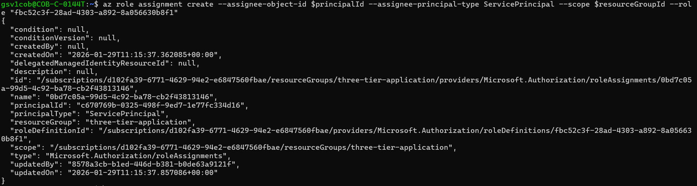

- Create an association resource
```bash
ASSOCIATION_NAME='association-test'
az network alb association create -g $RESOURCE_GROUP -n $ASSOCIATION_NAME --alb-name $AGFC_NAME --subnet $ALB_SUBNET_ID
```
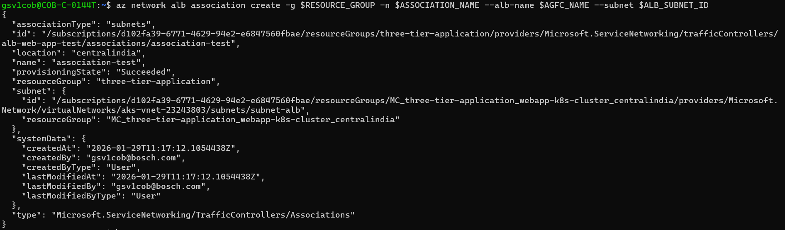

**Important steps:**
- Deploy the required Gateway API resources (argocd-todo-stack/manifest/gateway-api-configuration/gateway.yaml)
- Once the gateway is created, create an HTTPRoute for both frontend and backend (argocd-todo-stack/manifest/gateway-api-configuration/httproute-frontend.yaml) and httproute-backend.yaml

- Install ArgoCD on AKS for GitOps based deployment
```bash
# install ArgoCD in k8s
kubectl create namespace argocd
kubectl apply -n argocd -f https://raw.githubusercontent.com/argoproj/argo-cd/stable/manifests/install.yaml

# access ArgoCD UI
kubectl get svc -n argocd
kubectl port-forward svc/argocd-server 8080:443 -n argocd

# login with admin user and below token (as in documentation):
kubectl -n argocd get secret argocd-initial-admin-secret -o jsonpath="{.data.password}" | base64 --decode && echo

# you can change and delete init password
```


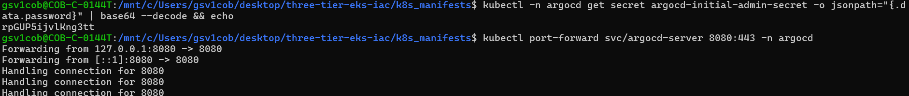

# Application Deployment

## Method 1: Using ArgoCD UI

1. Navigate to ArgoCD UI at `https://localhost:8080` (After the port-forward)
2. Click **+ NEW APP**
3. Fill in the application details:
   - **Application Name**: `todo-stack`
   - **Project**: `default`
   - **Sync Policy**: `Automatic`
   - **Repository URL**: `https://github.com/cloudvignesh/argocd-todo-stack`
   - **Path**: `manifests`
   - **Cluster**: `https://kubernetes.default.svc`
   - **Namespace**: `default`
4. Click **CREATE**

## Method 2: Using kubectl (Declarative)

```bash
# Apply the ArgoCD Application manifest
kubectl apply -f application.yaml
```

## Method 3: Using ArgoCD CLI

```bash
argocd app create todo-stack \
  --repo https://github.com/cloudvignesh/argocd-todo-stack \
  --path manifests \
  --dest-server https://kubernetes.default.svc \
  --dest-namespace default \
  --sync-policy automated \
  --auto-prune \
  --self-heal
```

## Verify Deployment
```bash
# Check todo application pod is deployed
kubectl get pods -n workshop

# Check application sync status
kubectl get application -n argocd
```
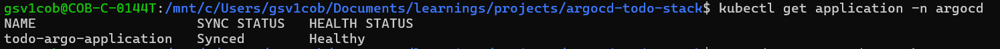


## GitOps Workflow

## Making Changes

1. **Update Code/Manifests**
   ```bash
   # Edit your files
   vim src/frontend/src/App.js
   # or
   vim manifests/frontend/deployment.yaml
   ```

2. **Commit and Push** 
   ```bash
   git add .
   git commit -m "Update frontend component"
   git push origin main
   ```
   Once Pushed, Github Actions will trigger the pipeline and push the updated image in to ACR. Refer the GitHub Actions files under .github/workflows folder

   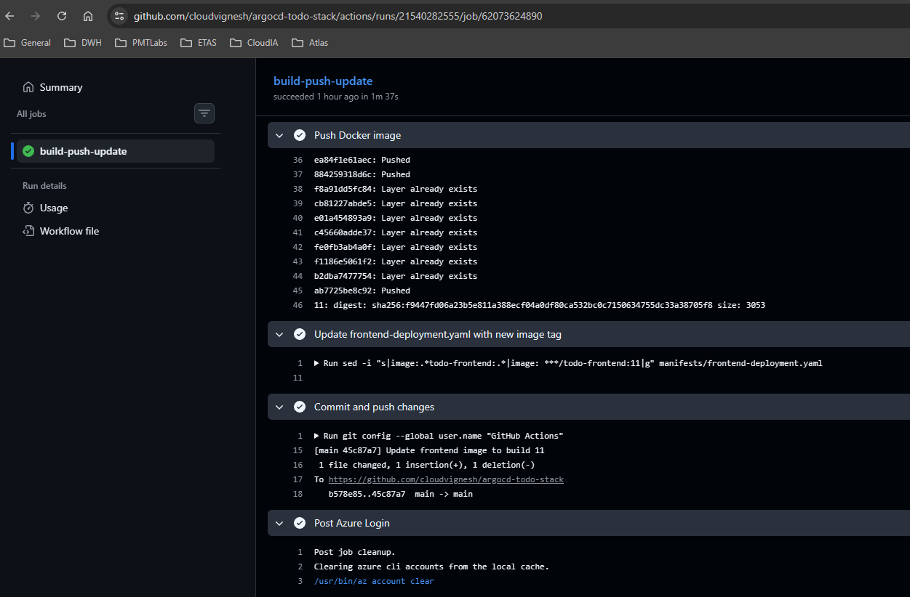

   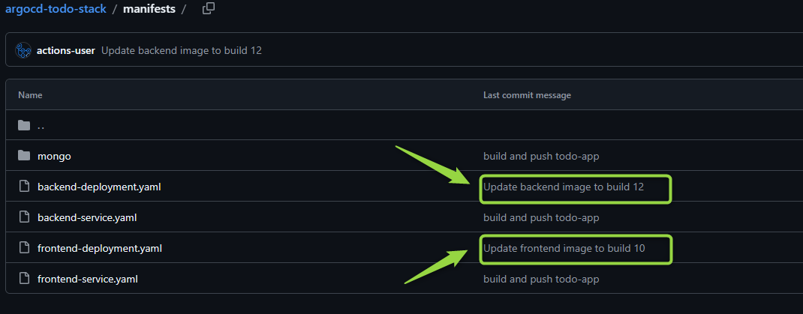

3. **ArgoCD Syncs Automatically**
   - ArgoCD detects changes (every 3 minutes by default)
   - Compares desired state (Git) with live state (Kubernetes)
   - Automatically syncs if auto-sync is enabled
   - Health status is updated in real-time

   

4. **Access the to-do application**

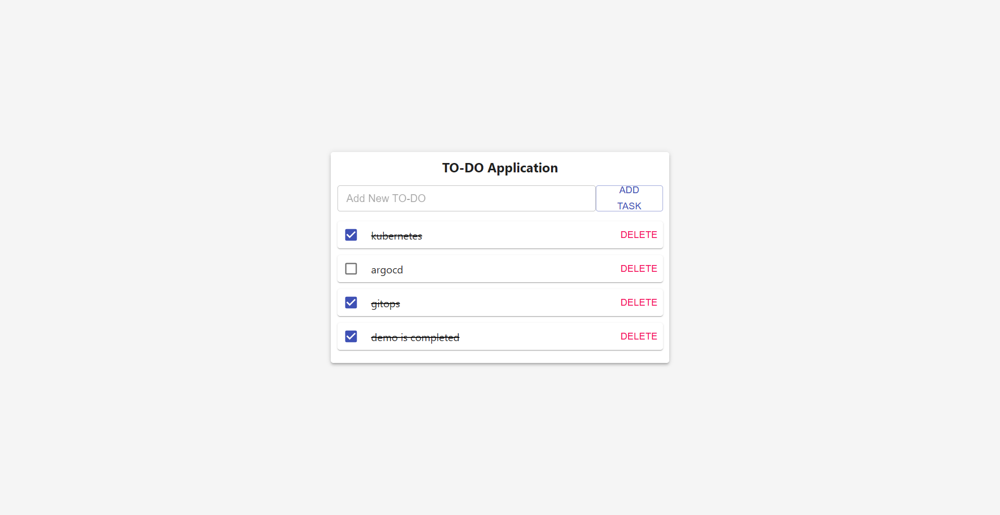

# License

This project is licensed under the MIT License - see the [LICENSE](LICENSE) file for details.

# Acknowledgments

- [ArgoCD](https://argo-cd.readthedocs.io/) - GitOps continuous delivery tool
- [Azure Kubernetes Service](https://azure.microsoft.com/en-us/services/kubernetes-service/) - Managed Kubernetes service
- [Kubernetes](https://kubernetes.io/) - Container orchestration platform

# Support

For issues, questions, or contributions:

- **GitHub Issues**: [Create an issue](https://github.com/cloudvignesh/argocd-todo-stack/issues)
- **Pull Requests**: [Submit a PR](https://github.com/cloudvignesh/argocd-todo-stack/pulls)
- **Documentation**: Check the [ArgoCD Documentation](https://argo-cd.readthedocs.io/)

# Next steps

- [ ] Add Helm chart support
- [ ] Implement blue-green deployments
- [ ] Add prometheus monitoring
- [ ] Setup automated testing in CI/CD
- [ ] Add multi-environment support (dev/staging/prod)
- [ ] Implement sealed secrets for sensitive data
- [ ] Add disaster recovery procedures
- [ ] Create terraform modules for infrastructure

---

**Built with ❤️ by [cloudvignesh](https://github.com/cloudvignesh)**